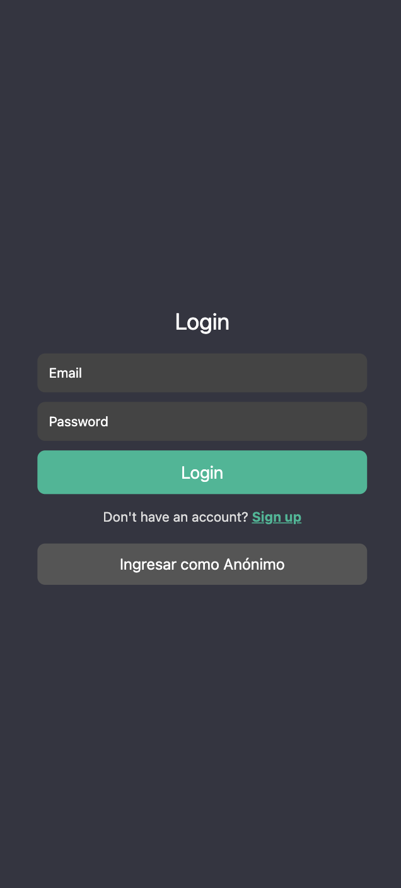
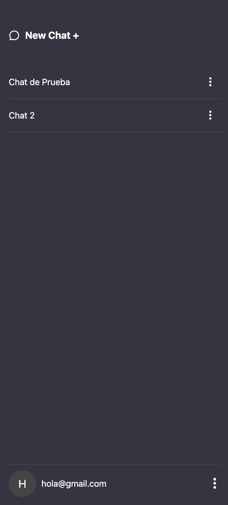
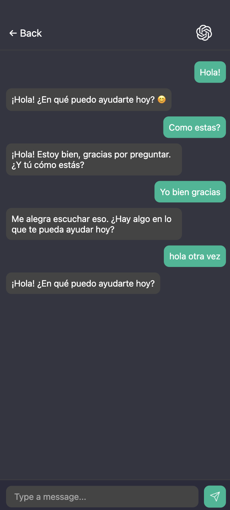

# Chat App - React Native con Expo y Firebase

## 📌 Descripción
Esta aplicación de chat está construida con **React Native** utilizando **Expo Router** y **Firebase**. Permite a los usuarios autenticarse, crear chats y comunicarse con un bot basado en la API de **Gemini** (IA de Google).

## 🚀 Características
- **Autenticación con Firebase:** Iniciar sesión con email/contraseña o anónimamente.
- **Gestión de chats:** Crear, editar y eliminar chats asociados a cada usuario.
- **Mensajería con IA:** Envío de mensajes a la API de Gemini y almacenamiento en Firestore.
- **Diseño optimizado:** UI moderna con modo oscuro.
- **Expo Router:** Navegación fluida entre pantallas.

## 🛠 Tecnologías Utilizadas
- **React Native** con Expo Router
- **Firebase Authentication** y **Firestore**
- **Gemini API** (Google Generative AI)
- **React Context API** para manejo de estado
- **TypeScript** para tipado seguro

## 📂 Estructura del Proyecto
```
📦 chat-app
 ┣
 ┣ 📂 app
 ┃ ┣ 📜 _layout.tsx      # Configuración de navegación
 ┃ ┣ 📜 auth.tsx         # Pantalla de autenticación
 ┃ ┣ 📜 dashboard.tsx    # Lista de chats
 ┃ ┣ 📜 conversation.tsx # Chat individual
 ┃ ┣ 📜 firstScreen.tsx  # Pantalla de bienvenida
 ┃ ┗ 📜 splash.tsx       # Pantalla de carga inicial
 ┣ 📂 assets
 ┣ 📂 context
 ┃ ┣ 📜 AuthProvider.tsx  # Contexto de autenticación
 ┃ ┗ 📜 DataContext.tsx   # Contexto de gestión de datos (chats)
 ┣ 📂 interfaces
 ┃ ┗ 📜 AppInterfaces.ts  # Interfaces de datos
 ┣ 📂 utils
 ┃ ┗ 📜 firebaseConfig.ts # Configuración de Firebase
 ┣ 📜 .env.example       # Archivo ejemplo para variables de entorno
 ┣ 📜 app.json           # Configuración de Expo
 ┣ 📜 babel.config.js    # Configuración de Babel
 ┣ 📜 package.json       # Dependencias del proyecto
 ┗ 📜 README.md          # Documentación del proyecto
```

## 🔧 Instalación y Configuración
### 1️⃣ Clonar el repositorio
```sh
git clone https://github.com/usuario/chat-app.git
cd chat-app
```
### 2️⃣ Instalar dependencias
```sh
npm install
```
### 3️⃣ Configurar Firebase
- Crear un proyecto en [Firebase](https://console.firebase.google.com/)
- Habilitar **Authentication** (email/contraseña y anónimo)
- Configurar **Firestore** con una colección `chats`
- Agregar el archivo `firebaseConfig.ts` en `utils/` con las credenciales del proyecto

### 4️⃣ Configurar Variables de Entorno
Renombrar `.env.example` a `.env` y agregar la clave de API de **Gemini**:
```
GEMINI_API_KEY=TU_CLAVE_DE_API
```

### 5️⃣ Ejecutar la Aplicación
```sh
npm start
```

## 📌 Funcionalidades Clave
### 🔹 Autenticación
📌 Implementada en `AuthProvider.tsx`:
- `login(email, password)`: Iniciar sesión.
- `register(email, password)`: Crear cuenta.
- `anonymousLogin()`: Acceso sin registro.
- `logout()`: Cerrar sesión.

### 🔹 Chats
📌 Gestionados en `DataContext.tsx`:
- `createChat(text, messages)`: Crea un nuevo chat.
- `updateChat(id, messages)`: Actualiza los mensajes de un chat.
- `getChats()`: Obtiene los chats del usuario.

### 🔹 Mensajería con Gemini
📌 Manejada en `geminiApi.ts`:
```ts
export const getGeminiResponse = async (userMessage: string): Promise<string> => {
  try {
    const response = await fetch(API_URL, {
      method: 'POST',
      headers: { 'Content-Type': 'application/json' },
      body: JSON.stringify({ contents: [{ parts: [{ text: userMessage }] }] })
    });
    const data = await response.json();
    return data?.candidates?.[0]?.content?.parts?.[0]?.text || 'No response received.';
  } catch (error) {
    console.error('Error fetching API:', error);
    return 'Error en la respuesta del bot.';
  }
};
```

## 🎨 Capturas de Pantalla
| Pantalla | Imagen |
|----------|--------|
| **Splash Screen** | 🖼️  |
| **Welcome page** | 🖼️  |
| **Login** | 🖼️  |
| **Lista de Chats** | 🖼️  |
| **Chat con IA** | 🖼️  |

## 📜 Licencia
Este proyecto está bajo la **MIT License**.

---
💡 **Desarrollado por:** [Rita Cruz](https://github.com/ritatrcr) 🚀

